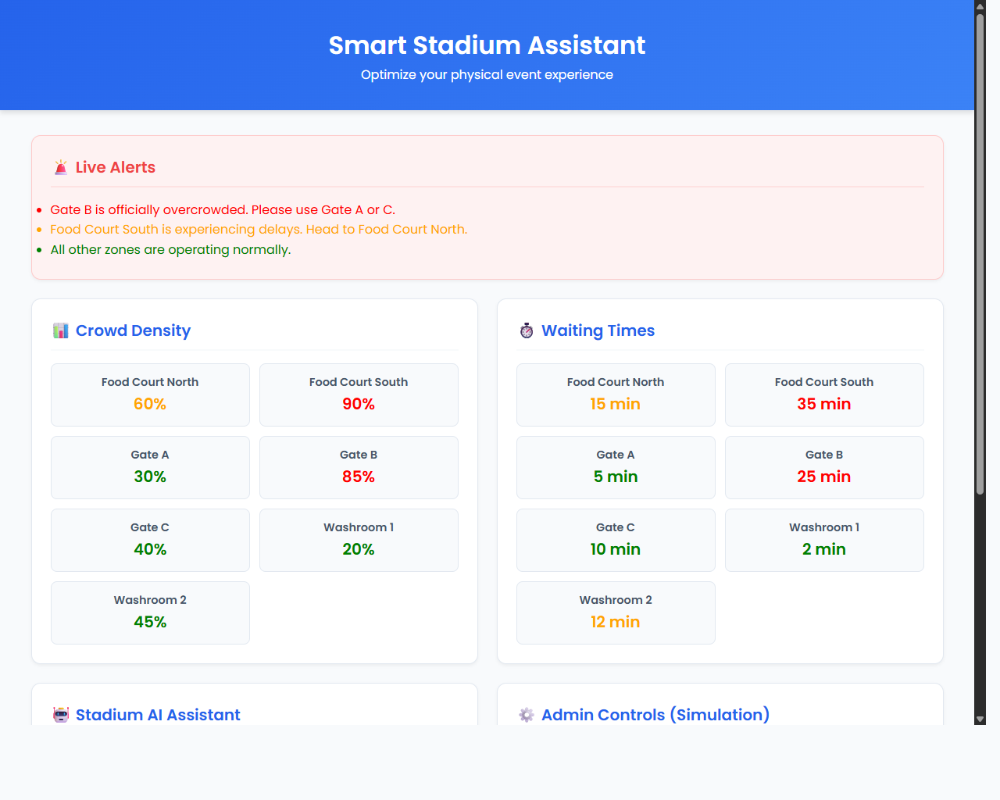

# Smart Stadium Assistant



## 1. Project Title
Smart Stadium Assistant System

## 2. Problem Statement
Large-scale sporting venues suffer from crowd congestion, long waiting times at gates/food stalls/washrooms, and poor coordination for attendees navigating the massive infrastructure.

## 3. Chosen Vertical
Smart Sporting Venue Experience

## 4. Features Explanation
- **Smart Crowd Navigation**: Recommends the least crowded pathways and gates based on simulated stadium zone data.
- **Queue & Waiting Time Optimizer**: Dynamically displays wait times for distinct stadium facilities.
- **AI Chatbot Assistant**: A rule-based assistant that immediately answers queries about fastest food stalls, nearest washrooms, and least crowded gates.
- **Emergency Alert System**: Broadcasts high-priority alerts to redirect crowds during congestion or emergencies.
- **Admin Dashboard**: Interfaces for administration to fetch, refresh, and trigger new states (simulated).

## 5. Architecture Diagram (Text-based)
```text
[ Frontend (HTML/CSS/JS) ] 
       │      │       │
      GET    GET    POST  (Fetch API over HTTP)
       │      │       │
[ Backend (Python Flask API) ]
       │
[ JSON Data Store (data.json) ]
```

## 6. How It Works
- The vanilla JS frontend calls local REST endpoints.
- The Flask backend fetches simulated live data from `data.json`.
- The rule-based chatbot parses exact keyword queries ('fastest', 'gate', 'food', 'washroom') and returns the optimum entity with minimum queue length or crowd capacity.

## 7. Tech Stack
- **Frontend**: HTML5, CSS3, Vanilla JavaScript
- **Backend**: Python (Flask, Flask-CORS)
- **Data storage**: Local JSON mimicking NoSQL database behaviors

## 8. Google Services Used

- Firebase Realtime Database (Architecture-ready integration)
- Google Maps API (Planned for indoor navigation extension)

Note: Due to lightweight prototype constraints, APIs are simulated using JSON data, but system is designed for direct integration.

## 9. Assumptions
- Real-world indoor navigation APIs will supply exact metric distances (simulated here by lowest absolute Wait Time or Crown Density).
- Data source is updated asynchronously by external stadium sensors.

## 10. Setup Instructions
1. Install Python 3.8+
2. Install dependencies: `pip install flask flask-cors`
3. Open terminal in the `backend/` folder and run: `python app.py`
4. Open `frontend/index.html` in your web browser.

## 11. Future Improvements
- Integrate conversational AI API (e.g. Gemini) for natural language understanding rather than keyword rules.
- Add Google Maps Indoor API for visual pathfinding overlaid on stadium blueprints.
- Replace `data.json` with a live Firebase instance.

## 12. Decision Logic

- Least crowded gate = minimum crowd density
- Fastest service = minimum wait time
- Navigation = avoids high-density zones
- Chatbot = keyword-based intelligent response

## 13. Real-World Impact

- Reduces congestion and improves safety
- Saves time for attendees
- Enhances user experience
- Helps stadium authorities manage crowds efficiently

## 14. Demo Output

### Live Alerts
- Gate B is overcrowded → redirect to Gate A/C
- Food Court South delay → suggest North

### Example Chatbot Queries
Input: fastest food  
Output: Food Court North (15 min)

Input: least crowded gate  
Output: Gate A (30%)

Input: nearest washroom  
Output: Washroom 1 (2 min)

## 15. Innovation Highlight

This system mimics real-time stadium intelligence using lightweight AI logic, making it deployable even in low-resource environments.